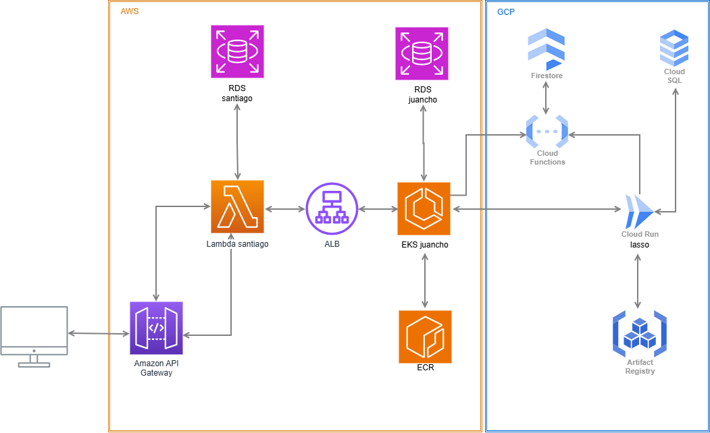

# DevOps - Seguimiento #1 (2026-1)

## 📋 Project Overview

This project consists of building a RESTful API using Go (net/http) with real database persistence. The application is designed to manage students, courses, and enrollments, ensuring high quality through automated testing and CI/CD practices.

---


## 🚀 Tech Stack

- **Language:** Go (1.21+)
- **HTTP Router:** gorilla/mux
- **Database:** PostgreSQL
- **ORM:** GORM
- **CI/CD:** GitHub Actions
- **Testing:** Testify, SQLMock

---

##  API Endpoints

### 👨‍🎓 Students
| Method | Endpoint | Description |
| :--- | :--- | :--- |
| `POST` | `/students` | Register a new student |
| `GET` | `/students` | List all students |
| `GET` | `/students/{id}` | Get student details |
| `PATCH` | `/students/{id}` | Partial update |
| `PUT` | `/students/{id}` | Full update |
| `DELETE` | `/students/{id}` | Remove student |
| `POST` | `/api/v2/students` | Register a new student chain |


### 📚 Courses
| Method | Endpoint | Description |
| :--- | :--- | :--- |
| `POST` | `/courses` | Create a new course |
| `GET` | `/courses` | List all courses |
| `GET` | `/courses/{id}` | Get course details |
| `PATCH` | `/courses/{id}` | Partial update |
| `PUT` | `/courses/{id}` | Full update |
| `DELETE` | `/courses/{id}` | Remove course |

### 📝 Enrollments
| Method | Endpoint | Description |
| :--- | :--- | :--- |
| `POST` | `/enrollments` | Enroll a student in a course |
| `GET` | `/enrollments` | List all enrollments |
| `GET` | `/enrollments/{id}` | Get enrollment details |
| `PATCH` | `/enrollments/{id}` | Update total amount/status |
| `PUT` | `/enrollments/{id}` | Replace enrollment data |
| `DELETE` | `/enrollments/{id}` | Cancel enrollment |

---

## ⚙️ Chain Diagram



---

## ⚙️ Environment Variables

Create a `.env` file in the root directory to manage your local configuration:

```env
DATABASE_HOST=localhost
DATABASE_PORT=5432
DATABASE_USER=your_user
DATABASE_PASSWORD=your_password
DATABASE_NAME=your_db
URL=url_second_chain
```

